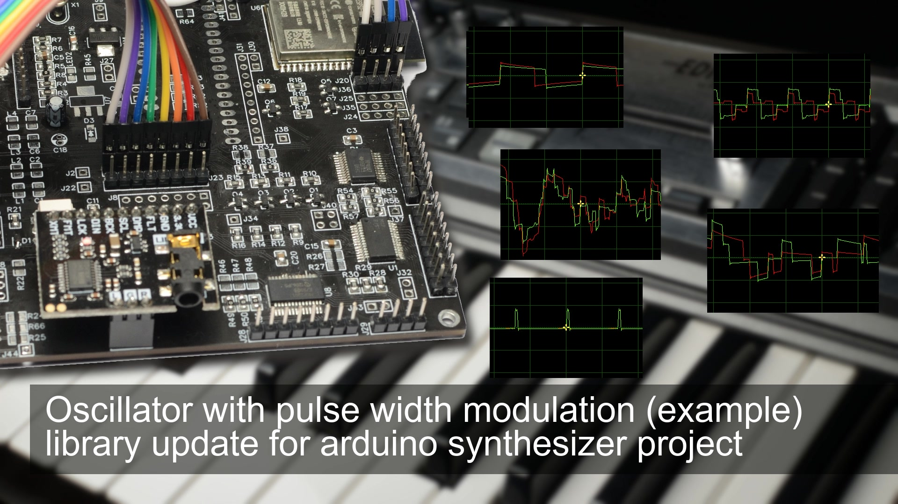

<h1 align="center">ml_synth_pwm_osc_example</h1>
<h3 align="center">pulse oscillator with pulse width modulation using the ML_SynthTools library (little example arduino project)</h3>  

 
   
  <a href="https://youtu.be/8ipPJ8rEOQM">link to the video</a>

This project is an example supporting different platforms:
- ESP32
- Teensy 4.1 (imxrt1062)
- Daisy Seed (cortex-m7) (does compile but execution does not work)

The required library can be found here: https://github.com/marcel-licence/ML_SynthTools

Supported versions of board library
---
- ESP32 version 1.0.6 from https://github.com/espressif/arduino-esp32/releases/tag/1.0.6
- ESP32 version 2.0.2 from https://github.com/espressif/arduino-esp32/releases/tag/2.0.2
Please be aware that other versions might be not supported.

More information will be available in future